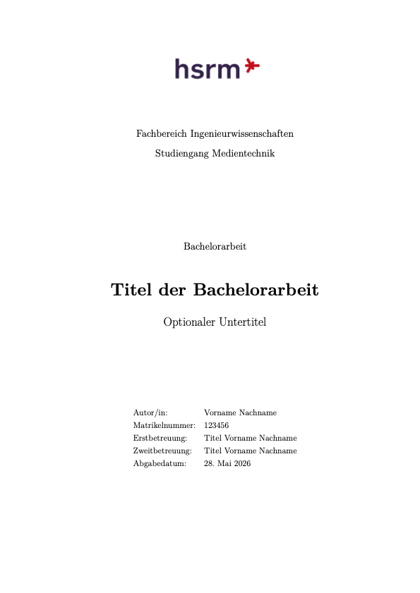
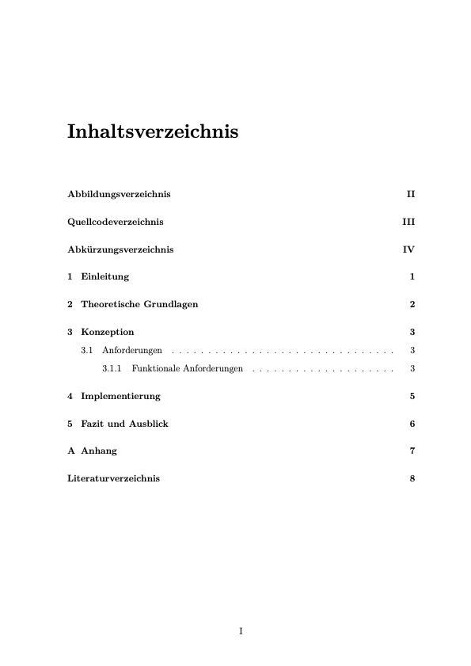

# HSRM LaTeX Thesis Template

This repository is a starter template for bachelor and project theses at
Hochschule RheinMain. It is intentionally small: edit the metadata, write your
chapters, add sources, and build `main.pdf`.

## Preview

<div class="grid cards" markdown>




</div>

The `docs/` folder is only used for repository presentation assets such as this
preview images. You can safely delete it when starting your own thesis.

## Quick Start

1. Edit `config/metadata.tex`.
2. Write your chapters in `sections/`.
3. Add bibliography entries to `references.bib`.
4. Build the PDF:

```sh
latexmk -pdf main.tex
```

To clean generated build files:

```sh
latexmk -c
```

## Structure

- `main.tex`: document order and front/back matter.
- `config/metadata.tex`: title, author, supervisors, programme, submission date.
- `config/preamble.tex`: packages, layout, PDF metadata, listing style.
- `sections/`: chapter files and front/back matter.
- `images/`: logo and image assets used by the thesis.
- `docs/`: optional preview assets for the GitHub repository.
- `references.bib`: BibTeX bibliography database.

## Common Tasks

### Add a Figure

```tex
\begin{figure}[htbp]
  \centering
  \includegraphics[width=0.8\textwidth]{images/my-figure.png}
  \caption{Short, descriptive caption}
  \label{fig:my-figure}
\end{figure}
```

Refer to it with `Abbildung~\ref{fig:my-figure}`.

### Add a Citation

Add the source to `references.bib`, then cite it:

```tex
\cite{my-source-key}
```

### Add an Acronym

Add acronyms in `sections/abkuerzungen.tex`:

```tex
\acro{API}{Application Programming Interface}
```

Use `\ac{API}` in the text.

## Before Submission

Check the current requirements from your programme, examination regulations, and
supervisor. In particular, verify title-page wording, required declarations,
margin requirements, citation style, digital submission rules, and whether a
printed copy is required. This template intentionally does not include a
declaration of independent work; add the official wording required by your
programme or examination office.
