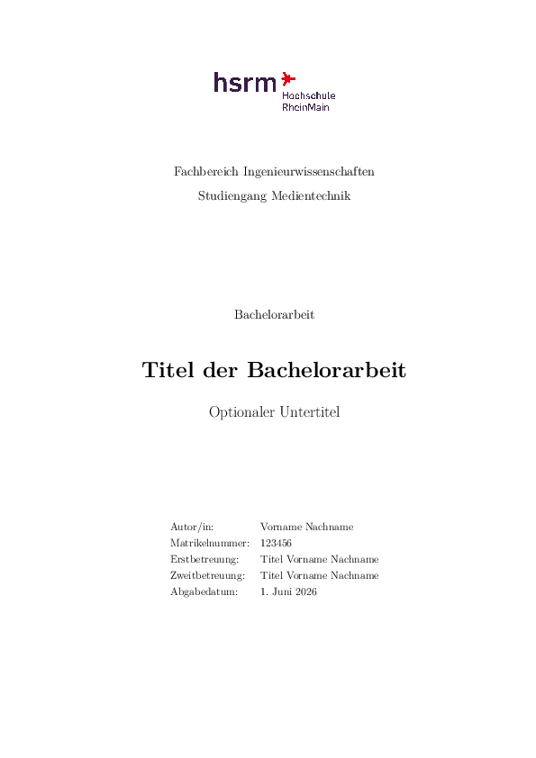
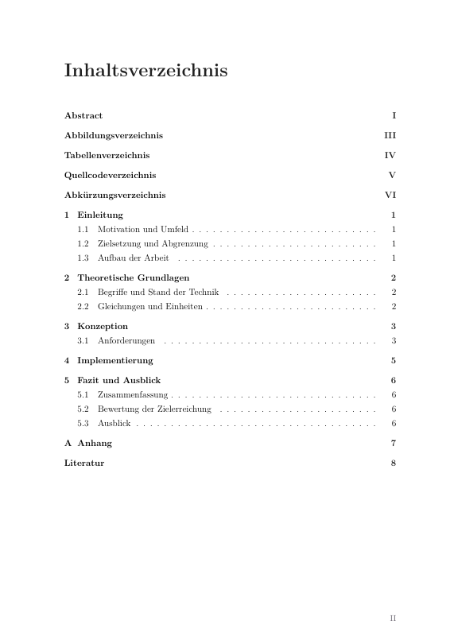
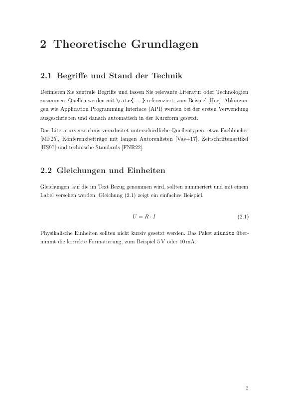

# LaTeX Thesis Template for Hochschule RheinMain

[](https://github.com/johind/hsrm-latex-template/releases/latest)
[](https://github.com/johind/hsrm-latex-template/actions/workflows/build.yml)
[](https://github.com/johind/hsrm-latex-template/releases/latest/download/hsrm-latex-template.zip)
[](#license)

This template provides a structured starting point for academic projects and
bachelor's and master's theses at Hochschule RheinMain. It includes a cover page,
a predefined chapter structure, consistent formatting and citations, as well as
cross-references, figures, tables, appendices and a bibliography.

Enter the document details in `config/metadata.tex`, add chapters under
`sections/`, manage sources in `references.bib`, and compile `main.tex`.

## Preview

| Cover Page                                    | Table of Contents                                  | Equations                                        |
| --------------------------------------------- | -------------------------------------------------- | ------------------------------------------------ |
|  |  |  |

Open the [complete PDF preview](https://github.com/johind/hsrm-latex-template/releases/latest/download/preview.pdf)
to review the generated document.

## Getting the Template

Choose one of the following setup methods.

### ZIP Download

1. Download [`hsrm-latex-template.zip`](https://github.com/johind/hsrm-latex-template/releases/latest/download/hsrm-latex-template.zip).
2. Extract the archive.

### Git

```sh
git clone https://github.com/johind/hsrm-latex-template.git
cd hsrm-latex-template
```

### Overleaf

1. Download [`hsrm-latex-template.zip`](https://github.com/johind/hsrm-latex-template/releases/latest/download/hsrm-latex-template.zip).
2. In Overleaf, select **New Project** and **Upload Project**.
3. Upload the ZIP file.
4. Set the compiler to **pdfLaTeX** and the main document to `main.tex`.

## Quick Start

Local builds require [TeX Live](https://tug.org/texlive/) or
[MiKTeX](https://miktex.org/download) with `latexmk`. Build the unchanged
template once to confirm that the LaTeX installation works:

```sh
latexmk -pdf main.tex
```

A successful build creates `main.pdf`. Then customize the document:

1. Set the title, document type, author, programme, supervisors, and submission
   date in `config/metadata.tex`.
2. Review the document order and optional lists in `main.tex`.
3. Write the chapters in `sections/`.
4. Add bibliography entries to `references.bib`.
5. Build the PDF:

```sh
latexmk -pdf main.tex
```

Run `make` to build the document with the included Makefile:

```sh
make
```

Use the following cleanup commands:

```sh
make clean       # Remove auxiliary files and keep main.pdf
make distclean   # Remove auxiliary files and main.pdf
```

## Structure

- `main.tex`: document order and optional front/back matter.
- `config/metadata.tex`: title, author, supervisors, programme, submission date.
- `config/preamble.tex`: packages, layout, PDF metadata, listing style.
- `Makefile`: commands for building the PDF and cleaning generated files.
- `AGENTS.md`: general project guidance for AI coding agents.
- `sections/`: English-named files for the cover page, front matter, chapters,
  and appendix.
- `images/`: logo and image assets used by the thesis.
- `docs/`: preview images for this repository; safe to delete.
- `references.bib`: BibTeX bibliography database.

## Common Tasks

### Add a Figure

```tex
\begin{figure}[htbp]
  \centering
  \includegraphics[width=0.8\textwidth]{images/my-figure.png}
  \caption{Short, descriptive caption}
  \label{fig:my-figure}
\end{figure}
```

Refer to it with `\cref{fig:my-figure}`.

### Add a Citation

Add the source to `references.bib`, then cite it:

```tex
\cite{my-source-key}
```

For online sources, include the URL and access date, for example with
`howpublished = {\url{...}}` and `note = {Zugriff am ...}`.
Protect brand names and unusual capitalization in BibTeX titles with braces,
for example `title = {{Hochschule RheinMain}}`.

### Add an Acronym

Add acronyms in `sections/acronyms.tex`:

```tex
\acro{API}{Application Programming Interface}
```

Use `\ac{API}` in the text. On first use it prints the long form with the
short form in parentheses; later uses print only the short form. Use `\acf` for
the full form, `\acs` for the short form, and `\acl` for the long form. The
[acronym package documentation](https://ctan.org/pkg/acronym) covers the
available commands, options, and plural forms.

### Add a Code Listing

Use the `listings` package for short, relevant code excerpts:

```tex
\begin{lstlisting}[language=Python,caption={Short example.},label={lst:example}]
def format_label(name):
    return f"Hallo {name}"
\end{lstlisting}
```

Change `language=Python` to another supported language such as `Java`, `C++`,
`SQL`, `HTML`, or `XML`. Put long listings in the appendix.

### Add a Numbered Equation

Use a numbered equation when you refer to it in the text:

```tex
\begin{equation}
  U = R \cdot I
  \label{eq:ohms-law}
\end{equation}
```

Refer to it with `\cref{eq:ohms-law}` or `\eqref{eq:ohms-law}`. Use `siunitx`
for physical units, for example `\qty{5}{\volt}`.

## Troubleshooting

- Run `latexmk -v` to confirm that `latexmk` is installed and available on the
  command line.
- Install any missing LaTeX package with the package manager supplied by TeX
  Live or MiKTeX.
- Run `make distclean` followed by `make` after changing packages, bibliography
  settings, or generated lists.

## Before Submission

This is an unofficial template. Confirm the required structure and formatting
with your programme, examination regulations, and supervisor.

- Add the declaration of independent work required by your programme.
- Replace `\today` with the fixed submission date in `config/metadata.tex`.
- Review the title, document type, author, student number, programme, and
  supervisors in `config/metadata.tex`.
- Obtain permission from Hochschule RheinMain before redistributing the
  included logo. See the [logo notice](#logo-notice).

## License

The MIT License covers the LaTeX template source.

### Logo Notice

Hochschule RheinMain retains the rights to the official logo in
`images/logo.png`. The maintainer has permission to include it in this
repository. This permission applies to this repository and cannot be
transferred.

Do not publish a fork, clone, mirror, release archive, generated PDF,
screenshot, or other redistributed copy that contains the logo unless you have
obtained your own permission from Hochschule RheinMain. If you publish or
redistribute a modified version of this template, remove or replace
`images/logo.png` and any generated assets that show it, such as preview images
or PDFs.
